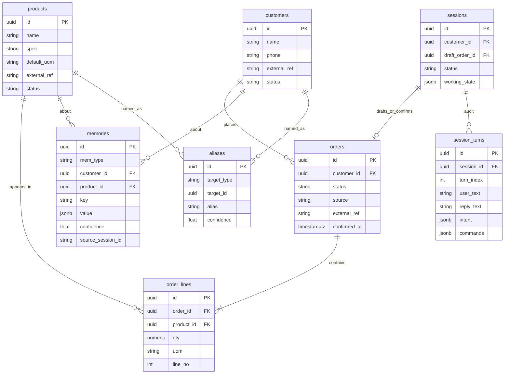
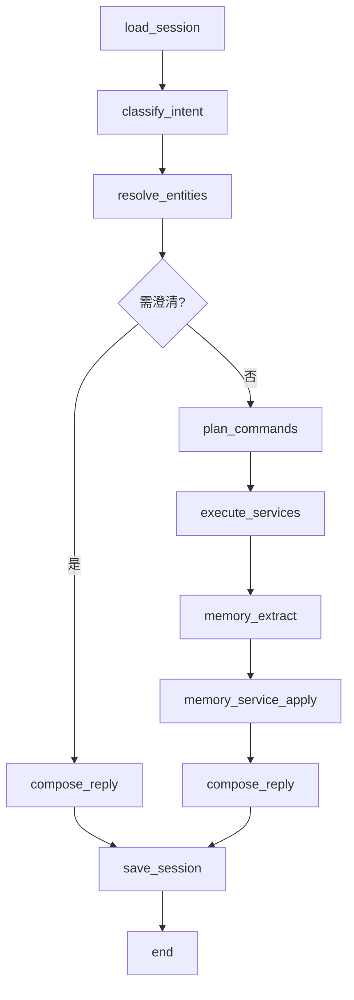

# AI 农批开单员 POC — 设计方案（第一阶段）

> 范围：Agent 后端核心。不接 ERP，不做前端 App。
> 交互：老板连续自然语言开单，系统维护订单上下文并产出结构化订单。

仓库根目录即项目根目录（GitHub 仓库已名为 `ai-order-clerk`），不再套一层同名文件夹。

---

## 1. 项目结构

```text
ai-order-clerk/
├── app/
│   ├── main.py                 # FastAPI 入口、生命周期、CORS/日志
│   ├── api/                    # 传输层：路由、DTO、鉴权占位、错误码
│   │   ├── deps.py             # 依赖注入（Session、Service、Graph）
│   │   ├── schemas.py          # 请求/响应 Pydantic（仅 API 形状）
│   │   └── routers/
│   │       ├── health.py
│   │       ├── sessions.py     # 开单会话 + 自然语言回合
│   │       └── orders.py       # 已确认订单查询
│   ├── agent/                  # LangGraph：意图、实体、工具调用、回复
│   │   ├── graph.py            # 图编译与节点连线
│   │   ├── state.py            # GraphState（TypedDict / Pydantic）
│   │   ├── nodes/              # 单节点，禁止访问 ORM
│   │   ├── tools.py            # 工具签名 → 调用 Service（唯一出口）
│   │   ├── prompts.py
│   │   └── llm.py              # OpenAI Compatible 客户端
│   ├── session/                # 开单会话与工作记忆（短期、随会话）
│   │   ├── state_machine.py    # draft → confirming → confirmed / cancelled
│   │   └── working_memory.py   # 当前客户、草稿行、待澄清项
│   ├── memory/                 # 长期记忆：Extractor + 策略，不存全文
│   │   ├── extractor.py
│   │   ├── policy.py           # 什么可记、什么必须忽略
│   │   └── types.py
│   ├── entity/                 # 领域实体/值对象：结构化、无 IO、无 ORM
│   ├── models/                 # SQLAlchemy ORM，仅 database/services 可引用
│   ├── database/               # engine、UnitOfWork、Alembic 入口
│   ├── services/               # 唯一允许碰库的业务层 + 未来 ERP Port
│   │   ├── customer_service.py
│   │   ├── product_service.py
│   │   ├── order_service.py
│   │   ├── session_service.py
│   │   ├── memory_service.py
│   │   └── ports/
│   │       └── erp.py          # Protocol，第一阶段 NoOp / LocalPersist
│   └── tests/
│       ├── test_intent.py
│       ├── test_entity_resolve.py
│       ├── test_order_merge.py
│       ├── test_memory_policy.py
│       └── test_api_turn.py
├── alembic/
├── docs/DESIGN.md
├── pyproject.toml
├── .env.example
└── README.md
```

### 1.1 分层与依赖方向

```text
api  →  agent  →  tools  →  services  →  models/database
              ↘  session
              ↘  memory/extractor → memory_service
entity  ←  被 agent / services / api 共用（纯结构）
```

硬约束：

| 模块 | 允许 | 禁止 |
| --- | --- | --- |
| `agent/` | 读 `entity`、调 `tools`、维护 GraphState | import `models`、`database`、写 SQL |
| `memory/extractor` | 读本回合结构化快照，产出 MemoryCandidate | 直接落库 |
| `services/` | ORM、事务、调用 ERP Port | 调用 LLM |
| `api/` | 启会话、投递用户话、返回快照 | 把自然语言直接塞进 SQL |

AI 不操作数据库：图节点只能发出 `ServiceCommand`，由 `tools.py` 转到 Service。Service 是唯一写路径。

### 1.2 模块职责

- **session**：一次「开单」的生命周期。工作记忆只活在会话里：当前客户、草稿行、待澄清、最近若干回合摘要（不是聊天全量）。
- **memory**：跨会话的稳定知识。必须经过 Extractor，默认不记。
- **entity**：客户、商品、数量、草稿单等的 Pydantic 结构，Agent 与 Service 的共同语言。
- **services**：解析后的结构化命令落地；预留 ERPNext 适配。

---

## 2. 核心数据模型

分三套，禁止混用：

1. **Entity（领域）**：Agent / Service 之间传递。
2. **ORM Model（持久化）**：表映射，不出 Agent。
3. **API Schema**：HTTP 入出参，可从 Entity 投影，不反向污染领域。

### 2.1 领域实体（`app/entity`）

```text
CustomerRef        id?, name, aliases[], match_confidence
ProductRef         id?, name, spec?, default_uom, aliases[], match_confidence
Quantity           value: Decimal, uom: str          # 件 / 个 / 箱 / 斤
OrderLine          line_id, product: ProductRef, qty: Quantity, source_span, merge_op
DraftOrder         order_id?, customer: CustomerRef?, status, lines[], remarks?
ConfirmedOrder     由 DraftOrder 冻结：全字段必填、行必须已解析到 product.id
Intent             type, slots, confidence, raw_text
ServiceCommand     name, payload（结构化，无自然语言）
MemoryCandidate    type, subject, key, value, confidence, action(create|update|ignore)
SessionSnapshot    session_id, status, draft, pending_clarifications[], turn_index
AgentTurnResult    reply_text, snapshot, commands_executed[], memories_applied[]
```

`Intent.type` 枚举（第一阶段）：

| Intent | 例句 | 槽位 |
| --- | --- | --- |
| `start_order` | 「开王老板的单」 | customer_mention |
| `add_line` | 「加两个金边榴莲」 | product_mention, qty, uom? |
| `set_line` | 「苹果60件」 | product_mention, qty, uom? |
| `remove_line` | 「梨不要了」 | product_mention |
| `confirm_order` | 「好了」 | — |
| `cancel_order` | 「这单作废」 | — |
| `query_draft` | 「现在有啥」 | — |
| `clarify` | 「是红富士」 | 回答 pending 问题 |
| `unknown` | 闲聊/听不清 | — |

行合并策略（农批口述习惯，写进 `OrderService`，不让模型自由发挥）：

- 无该商品行 + 光杆「品名+数量」→ **新增**（`set_line`/`add_line` 等价于 add）。
- 已有该商品行 + 光杆「品名+数量」→ **覆盖数量**（老板在改口，不是再累加一笔）。
- 带「加 / 再来 / 再加」→ **累加**。
- 带「改成 / 改到」→ **覆盖**。

### 2.2 会话工作记忆 vs 长期记忆

| | 工作记忆（session） | 长期记忆（memory） |
| --- | --- | --- |
| 生命周期 | 随开单会话，确认或超时后冻结/归档 | 跨会话 |
| 内容 | 当前客户、草稿行、待澄清、最近 K 轮结构化摘要 | 别名、习惯、默认单位 |
| 写入 | 每回合 SessionService 更新 | **仅 Extractor 放行** |
| 不存 | 聊天全文 | 聊天全文、当笔数量、一次性口误 |

最近 K 轮只存结构化摘要，例如 `{intent, entities, command_names}`，不存 raw 对话 blob 作为记忆。

---

## 3. 数据库设计

第一阶段全部在 PostgreSQL。命名：`snake_case`，UUID 主键，`created_at`/`updated_at`。

### 3.1 ER 关系



### 3.2 表职责

**customers / products**  
主数据。第一阶段本地维护；`external_ref` 预留给 ERPNext 的 `Customer` / `Item` 名。

**aliases**  
可检索别名（王老板、金边榴莲）。与 memories 的区别：aliases 是解析器用的确定性索引；memories 是 Extractor 产出的带理由知识。别名可由 Extractor 建议、由 MemoryService 写入 aliases。

**orders / order_lines**  
唯一订单事实。`status`: `draft | confirmed | cancelled`。草稿在确认前也可落库（便于崩溃恢复），对 Agent 暴露的是 `DraftOrder` 实体。

**sessions**  
`working_state` JSONB 只放结构化快照（客户、行、pending、turn_index），**不是聊天记录**。

**session_turns**  
审计/调试用，可选保留原文。**明确不是 Memory**。第一阶段可写；记忆检索不得扫此表。

**memories**  
`mem_type`：

- `customer_alias`
- `product_alias`
- `preferred_uom`
- `customer_habit`（第一阶段 Extractor 默认 ignore，策略放开后再写）

唯一约束建议：`(mem_type, key, customer_id, product_id)` 部分唯一，便于 upsert。

**outbox_events**（建议第一阶段建表、暂不消费）

```text
id, event_type, aggregate_id, payload jsonb, created_at, published_at
```

`order.confirmed` 写入 outbox，未来 ERPNext adapter 拉取。Agent 不碰这张表。

### 3.3 索引（POC 够用）

- `aliases (target_type, lower(alias))` 唯一
- `order_lines (order_id, line_no)` 唯一
- `memories (mem_type, key)`
- `sessions (status, updated_at)`

主数据先用种子：若干客户（含王老板）、若干 SKU（苹果、梨、金边榴莲/榴莲）。模糊匹配第一阶段可用 `pg_trgm`。

---

## 4. API 设计

第一阶段只有后端。调用方可以是 curl、测试、或以后的任意客户端。所有写业务都经过 Service；Agent 入口只有「投递一句话」。

### 4.1 会话与开单

**`POST /v1/sessions`**  
开一个空会话。可带 `customer_id`（可选）。返回 `SessionSnapshot`。

**`POST /v1/sessions/{session_id}/turns`**

```json
{ "text": "开王老板的单" }
```

响应：

```json
{
  "reply": "好，给王老板开单。请报品名和数量。",
  "session": {
    "id": "...",
    "status": "drafting",
    "draft": {
      "customer": { "id": "...", "name": "王老板" },
      "status": "draft",
      "lines": []
    },
    "pending_clarifications": []
  },
  "intent": { "type": "start_order", "confidence": 0.92 },
  "memories_applied": []
}
```

这是唯一的自然语言入口。确认、加行、改数量都走这句话，不提供「表单式」加行 API 给用户（测试可直接打 Service，不暴露为产品 API）。

**`GET /v1/sessions/{session_id}`**  
当前快照，不含聊天全文。

**`GET /v1/sessions/{session_id}/draft`**  
当前结构化草稿订单。

### 4.2 已确认订单

**`GET /v1/orders/{order_id}`**  
确认后的结构化订单（客户、行、数量、单位、时间）。

**`GET /v1/orders/{order_id}/events`**（可选）  
outbox 中该单事件，便于以后对 ERP 联调。

不提供第一阶段的 `POST /v1/orders` 表单创建。

### 4.3 健康与就绪

- `GET /health` — 进程存活
- `GET /ready` — DB 可连接

### 4.4 错误与澄清

| HTTP | 何时 |
| --- | --- |
| 200 | 含业务内澄清（商品歧义、未选客户）。用 `pending_clarifications` 表达，不是 4xx |
| 404 | session/order 不存在 |
| 409 | 会话已 confirmed/cancelled 仍来加行 |
| 422 | `text` 为空 |

歧义示例：库中有「金边榴莲」和「普通榴莲」，置信度接近 → `pending_clarifications: [{ field: "product", options: [...] }]`，reply 问一句，等下一回合 `clarify`。

### 4.5 鉴权

POC 可用 `X-Api-Key` 占位。不接用户体系。

---

## 5. Agent 流程设计

运行时：LangGraph。LLM：OpenAI Compatible（`base_url` + `api_key` + `model`）。结构化输出一律 Pydantic / JSON Schema，禁止「模型直接吐 SQL / 直接改 JSON 当订单」。

### 5.1 图状态

```text
GraphState
  session_id
  user_text
  snapshot          # 进入节点前由 SessionService 加载
  intent            # 结构化 Intent
  resolved          # CustomerRef / ProductRef / Quantity
  commands          # list[ServiceCommand]
  execution         # Service 回写
  memory_candidates
  reply_text
```

### 5.2 节点与边



| 节点 | 做什么 | 不可做什么 |
| --- | --- | --- |
| `load_session` | SessionService.get_snapshot | 扫聊天表当上下文 |
| `classify_intent` | LLM → `Intent` | 猜 customer_id/product_id |
| `resolve_entities` | ProductService / CustomerService 检索 + aliases + memories | 模糊匹配失败时瞎选 |
| `plan_commands` | Intent + 已解析实体 → `ServiceCommand[]` | 生成自然语言去「当命令」 |
| `execute_services` | tools 调 Order/Session Service | 节点内 SQL |
| `memory_extract` | 只看结构化快照差量 + 本回合 Intent | 把 `user_text` 整段入库 |
| `compose_reply` | 店员口吻，复述已解析行，缺槽就问 | 编造未落库的数量 |
| `save_session` | 写 working_state + 可选 session_turns 审计 | 把审计当记忆检索源 |

### 5.3 工具（Service 的薄封装）

Agent 可见工具仅这些：

1. `lookup_customer(mention: str) -> CustomerRef | list`
2. `lookup_product(mention: str) -> ProductRef | list`
3. `start_draft(customer_id: UUID) -> DraftOrder`
4. `apply_line(order_id, product_id, qty, uom, op: add|set|remove) -> DraftOrder`
5. `confirm_draft(order_id) -> ConfirmedOrder`
6. `cancel_draft(order_id) -> DraftOrder`
7. `get_draft(session_id) -> DraftOrder`

工具入参必须是已解析 ID 和数量，不允许 `raw_text`。`confirm_draft` 校验：客户已绑定、至少一行、无 pending 澄清、每行 `product.id` 非空。

### 5.4 Memory Extractor 策略

输入：本回合 Intent、解析实体、执行前后 DraftOrder 差量、该客户已有 memories。  
输出：`MemoryCandidate[]`，默认空。

**可记（create/update）**

- 成功绑定「王老板」且别名表没有 → `customer_alias`
- 「金边榴莲」成功落到某 SKU 且别名没有 → `product_alias`
- 该客户连续对某商品使用同一单位 → `preferred_uom`（需达到次数阈值，POC 可先阈值=3 或暂关）

**必须 ignore**

- 数量本身（60 件不是记忆）
- 「好了 / 开单 / 不要了」
- 未解析成功的提及
- 低置信度匹配（例如 &lt; 0.8）
- 把整句 user_text 当 key 或 value

Extractor 可以是小 LLM + 规则闸门：LLM 只建议，**规则闸门否决后不得写入**。写入只走 `MemoryService.apply(candidates)`。

### 5.5 目标对话的回合推演

| 用户 | Intent | 实体 | 命令 | 回复要点 |
| --- | --- | --- | --- | --- |
| 开王老板的单 | start_order | 王老板→Customer | start_draft | 已开王老板的单，请报货 |
| 苹果60件 | set_line | 苹果×60件 | apply_line set | 苹果 60 件 |
| 梨60件 | set_line | 梨×60件 | apply_line set | 苹果 60、梨 60 |
| 加两个金边榴莲 | add_line | 金边榴莲×2 个 | apply_line add | 三行清单 |
| 好了 | confirm_order | — | confirm_draft | 复述完整结构化订单并确认落库 |

「好了」时若缺客户或行为空：不调用 confirm，reply 追问，会话保持 `drafting`。

### 5.6 确认后的 ERP 预留

```text
OrderService.confirm()
  → 冻结 DraftOrder 为 confirmed
  → 写 outbox: OrderConfirmed
  → ErpPort.submit(ConfirmedOrder)   # Phase1: NoOp，只记日志
```

`ErpPort` Protocol：

- `upsert_customer` / `upsert_item` / `submit_sales_order`

Phase 1 实现 `LocalPostgresPort`（已在 confirm 时写入 orders）。Phase 2 加 `ERPNextPort`（REST：Customer、Item、Sales Order），不改 Agent 图。

---

## 6. 第一阶段明确不做

- 前端、语音、微信
- 价格、库存扣减、结算、打印（实体可留 `unit_price?` 字段但 Service 不填）
- ERPNext 实连
- 用聊天全文做 RAG
- 多租户、复杂权限
- Agent 内直接 `Session.execute(sql)`

## 7. 建议落地顺序（仍不在本次写代码）

1. entity + ORM + Alembic + 种子主数据
2. services（无 LLM 的开单/加行/确认，单测覆盖合并策略）
3. API：sessions + turns 先接「规则意图」打通
4. LangGraph + OpenAI Compatible 替换意图/槽位抽取
5. Memory Extractor 规则闸门
6. outbox + ErpPort NoOp

---

本文只定结构与契约。实现以前，以本文件为准；若改意图枚举、合行策略或记忆策略，先改设计再改代码。
