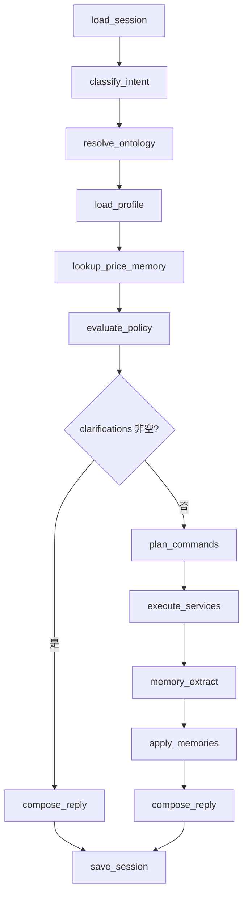

# AI 农批开单员 POC — 设计方案（第一阶段）

> 范围：Agent 后端核心。不接 ERP，不做前端 App。
> 交互：老板连续自然语言开单，系统维护订单上下文并产出结构化订单。
> 本文已按农批业务特殊性修订：商品不是零售 SKU，客户不是表单用户，价格先记后填、禁止编造。

仓库根目录即项目根目录（GitHub 仓库已名为 `ai-order-clerk`），不再套一层同名文件夹。

---

## 0. 农批特殊性（评审结论）

农批开单和零售点餐、电商下单不是同一类问题。上一版把「苹果」直接当成 SKU、把价格整段划出范围，会在真实档口对话里失效。

| 零售/表单假设 | 农批实际 | 设计后果 |
| --- | --- | --- |
| 商品 = 一个 SKU 名 | 「苹果」是品类/品种口语，真正履约要落到品种+等级+产地+规格+包装 | 必须有 Product Ontology；行上允许「解析层级」 |
| 用户每次选全规格 | 熟客只报品名数量，缺槽靠「他一直拿什么」 | Customer Profile 可填默认 SKU，但有闸门 |
| 下单必带价 | 先报量、价按今日行情或老价格，且行情日变 | Price Memory 带有效期；允许 `price_tbd` |
| 重复报数量 = 再买一份 | 光杆再报同一品通常是改口 | 合行策略保持覆盖；「加」才累加 |
| 单位单一 | 开单用「件/个」，计价常按「斤」，件重还会变 | 数量单位与计价单位分离 |
| 记聊天就能个性化 | 60 件、好了、口误都不是知识 | 记忆只经 Extractor；价格记忆尤其要过期 |

第一阶段仍不做：库存扣减、结算收款、送货调度、ERP 实连、前端。  
第一阶段**要做**：本体解析、客户档案回填、价格记忆与回填策略、显式 Decision Policy。

---

## 1. 项目结构

```text
ai-order-clerk/
├── app/
│   ├── main.py
│   ├── api/
│   │   ├── deps.py
│   │   ├── schemas.py
│   │   └── routers/
│   │       ├── health.py
│   │       ├── sessions.py
│   │       └── orders.py
│   ├── agent/                  # LangGraph；禁止 ORM
│   │   ├── graph.py
│   │   ├── state.py
│   │   ├── nodes/
│   │   ├── tools.py
│   │   ├── prompts.py
│   │   └── llm.py
│   ├── policy/                 # 确定性决策表，禁止 LLM 改写结论
│   │   ├── decision.py
│   │   ├── slot_priority.py
│   │   └── confirm_gate.py
│   ├── session/
│   │   ├── state_machine.py    # draft → confirming → confirmed / cancelled
│   │   └── working_memory.py
│   ├── memory/
│   │   ├── extractor.py
│   │   ├── policy.py
│   │   └── types.py
│   ├── entity/
│   ├── models/
│   ├── database/
│   ├── services/
│   │   ├── customer_service.py
│   │   ├── customer_profile_service.py
│   │   ├── product_service.py          # 检索
│   │   ├── ontology_service.py         # 层级解析、默认子节点
│   │   ├── order_service.py
│   │   ├── session_service.py
│   │   ├── memory_service.py
│   │   ├── price_memory_service.py
│   │   └── ports/erp.py
│   └── tests/
│       ├── test_intent.py
│       ├── test_ontology_resolve.py
│       ├── test_profile_defaults.py
│       ├── test_price_memory.py
│       ├── test_decision_policy.py
│       ├── test_order_merge.py
│       └── test_api_turn.py
├── alembic/
├── docs/DESIGN.md
├── pyproject.toml
├── .env.example
└── README.md
```

### 1.1 分层与依赖方向

```text
api  →  agent  →  tools  →  services  →  models/database
              ↘  policy          （纯函数，只吃结构化快照）
              ↘  session
              ↘  memory/extractor → memory_service / price_memory_service
entity  ←  被 agent / policy / services / api 共用
```

硬约束：

| 模块 | 允许 | 禁止 |
| --- | --- | --- |
| `agent/` | 读 entity、调 tools、维护 GraphState | import models/database；自己决定能否确认 |
| `policy/` | 对 Intent + 解析结果 + Profile + PriceMemory 做裁决 | 调 LLM、写库 |
| `memory/extractor` | 产出 MemoryCandidate | 直接落库 |
| `services/` | ORM、事务、ERP Port | 调 LLM、绕过 policy 的确认闸门 |
| `api/` | 启会话、投递用户话 | 自然语言直接进 SQL |

AI 不操作数据库：图节点只发 `ServiceCommand`。能否澄清、能否用档案默认、能否带价、能否「好了」，以 `policy/` 的 `DecisionVerdict` 为准，模型不得否决。

### 1.2 模块职责

- **ontology**：商品层级与别名；把口语提到的层级变成可履约节点。
- **customer profile**：熟客缺槽默认值（他的苹果是哪种）；不是 CRM 长文。
- **price memory**：行情/成交/报价，带单位与有效期。
- **policy**：槽位优先级、澄清阈值、确认闸门。
- **session**：本单工作记忆。
- **memory**：跨会话稳定知识（含档案增量、价格候选），必须过 Extractor。

---

## 2. 核心数据模型

分三套，禁止混用：

1. **Entity（领域）**：Agent / Service / Policy 之间传递。
2. **ORM Model（持久化）**：表映射，不出 Agent。
3. **API Schema**：HTTP 入出参，可从 Entity 投影。

### 2.1 领域实体（`app/entity`）

```text
# 商品本体
OntologyLevel      category | variety | cultivar | sku
ProductNode        id, level, parent_id?, name, attributes, default_uom, status
ProductAttributes  origin?, grade?, size?, packing?, piece_weight?, season?
ProductMention     raw, matched_node, resolved_sku?, resolve_level, confidence, candidates[]

# 客户档案
CustomerRef        id?, name, aliases[], match_confidence
CustomerProfile    customer_id, display_name, stall_no?, phones[],
                   settlement_mode, price_tier, product_defaults[], preferred_uoms[]

# 数量与价格（单位分离）
Quantity           value: Decimal, uom: str                 # 开单单位：件/个/箱
MoneyAmount        value: Decimal, currency: CNY
PriceQuote         unit_price, price_uom, source, valid_until?, confidence
                   # source: explicit | last_deal | last_quote | customer_special | market_today | tbd

# 订单
OrderLine          line_id, mention: ProductMention, product_sku_id?,
                   qty: Quantity, price: PriceQuote?, merge_op, line_status
DraftOrder         order_id?, customer, status, lines[], remarks?, price_mode
ConfirmedOrder     冻结快照；允许行价为 tbd（见确认闸门）

# 决策与记忆
Intent             type, slots, confidence, raw_text
ServiceCommand     name, payload
MemoryCandidate    type, subject, key, value, confidence, action, valid_until?
DecisionVerdict    allow_execute, slot_fills[], clarifications[], confirm_ok, reasons[]
SessionSnapshot    session_id, status, draft, profile_digest?, pending_clarifications[], turn_index
AgentTurnResult    reply_text, snapshot, verdict, commands_executed[], memories_applied[]
```

`line_status`：`unresolved | pending_clarify | ready | price_tbd | confirmed`。  
`resolve_level` 未到 `sku` 时，Policy 决定：用档案默认 / 用唯一子节点 / 追问，禁止模型直接点选。

### 2.2 意图枚举

| Intent | 例句 | 槽位 |
| --- | --- | --- |
| `start_order` | 「开王老板的单」 | customer_mention |
| `add_line` | 「加两个金边榴莲」 | product_mention, qty, uom? |
| `set_line` | 「苹果60件」 | product_mention, qty, uom? |
| `remove_line` | 「梨不要了」 | product_mention |
| `set_price` | 「苹果按3块」「榴莲三十一个」 | product_mention?, unit_price, price_uom? |
| `use_old_price` | 「还是老价格」 | product_mention? |
| `confirm_order` | 「好了」 | — |
| `cancel_order` | 「这单作废」 | — |
| `query_draft` | 「现在有啥」 | — |
| `clarify` | 「是红富士」 | 回答 pending |
| `unknown` | 闲聊/听不清 | — |

行合并策略（农批口述，写进 `OrderService`）：

- 无该品行 + 光杆「品名+数量」→ **新增**。
- 已有该品行 + 光杆「品名+数量」→ **覆盖数量**（改口）。
- 「加 / 再来 / 再加」→ **累加**。
- 「改成 / 改到」→ **覆盖**。
- 「品名」对齐键 = 已解析 `sku_id`，若尚未到 sku 则用 `matched_node.id`（同一品种口语并入一行，避免「苹果」和「红富士」裂成两行后无法合并）。

### 2.3 会话工作记忆 vs 长期记忆

| | 工作记忆（session） | 长期记忆 |
| --- | --- | --- |
| 生命周期 | 随开单会话 | 跨会话，价格类必须有过期 |
| 内容 | 客户、草稿行、待澄清、本单显式价、最近 K 轮结构化摘要 | 别名、档案默认、成交价/特价 |
| 写入 | SessionService | Extractor → MemoryService / PriceMemoryService |
| 不存 | 聊天全文 | 当笔数量、口误、已过期行情、整句原文 |

最近 K 轮只存 `{intent, entity_ids, command_names, verdict_reasons}`。

---

## 3. 数据库设计

PostgreSQL。UUID 主键，`created_at`/`updated_at`。

### 3.1 ER 关系


其余表（`customers`、`aliases`、`sessions`、`orders`、`order_lines`、`memories`、`session_turns`、`outbox_events`）职责同前，变更如下。

### 3.2 相对上一版的表变更

**product_nodes 替换扁平 products**  
`level ∈ {category, variety, cultivar, sku}`。只有 `sku` 可写入 `order_lines.product_id`（履约行）。口语匹配可以打在任意层。`attributes` 放产地/等级/规格/包装/件重/产季，不另拆宽表（POC）。

**product_uoms**  
例如某 SKU「1 件 = 20 斤」。开单单位与计价单位不一致时，PriceMemoryService 只换算有因子的行；没有因子则 Policy 澄清，禁止估算件重。

**customer_profiles**  
1:1 客户。`product_defaults`: `{ "variety_or_node_id": "sku_id" }`。`preferred_uoms` 同理。结算方式、价格档只归档，第一阶段不跑账期。

**order_lines 增列**

- `matched_node_id`：口语落到的本体节点
- `product_id`：可空，直到履约 SKU 确定
- `qty`, `uom`
- `unit_price`, `price_uom`, `price_source`, `price_status`（`explicit|memory|tbd|none`）

**price_memories**（独立于通用 memories）  
价格有时效、金额、计价单位，不和别名混在一张 jsonb 里。`price_type ∈ {market_today, last_deal, last_quote, customer_special}`。

**memories.mem_type 增补**

- `customer_alias` / `product_alias`（可同步 aliases）
- `preferred_uom`
- `product_default`（档案：王老板的苹果 → 某 sku）
- `customer_habit`：默认 ignore

**outbox_events** 仍在 confirm 时写 `order.confirmed`。payload 含行级 `price_status`，便于 ERP 侧决定是否暂缓生成 Sales Order 金额。

### 3.3 索引（POC）

- `product_nodes (parent_id, level)`
- `aliases (target_type, lower(alias))` 唯一
- `price_memories (price_type, product_id, customer_id, valid_until)`
- `order_lines (order_id, line_no)` 唯一
- `memories (mem_type, key)`

种子主数据必须是**树**，不是平铺同名 SKU：水果 → 苹果/梨/榴莲 → 红富士/金边榴莲等 → 带等级产地的 sku。模糊匹配可用 `pg_trgm`。

---

## 4. API 设计

唯一自然语言入口不变：`POST /v1/sessions/{id}/turns`。响应增补 `verdict` 与行级解析/价格状态，示例：

```json
{
  "reply": "王老板：苹果 60 件（按档案红富士 80#，价未报，记 TBD），梨 60 件。还要别的吗？",
  "verdict": {
    "allow_execute": true,
    "confirm_ok": false,
    "clarifications": [],
    "reasons": ["profile_default_sku:apple", "price_tbd:apple"]
  },
  "session": {
    "status": "drafting",
    "draft": {
      "customer": { "name": "王老板" },
      "lines": [
        {
          "mention": "苹果",
          "resolve_level": "sku",
          "sku_name": "红富士 80# 一级",
          "qty": 60,
          "uom": "件",
          "price_status": "tbd"
        }
      ]
    }
  }
}
```

`GET /v1/orders/{id}` 必须返回每行：本体路径、数量单位、价格来源、`price_status`。  
不提供表单加行、不提供管理员改价 UI（种子/SQL 即可）。  
HTTP 规则不变：业务澄清走 200 + `pending_clarifications`；已确认再加行 409。

---

## 5. Agent 流程设计

LLM 只负责 Intent 与槽位（品名、数量、价的**提及**）。解析、默认值、能否确认全部是 Service + Policy。

### 5.1 图状态

```text
GraphState
  session_id, user_text, snapshot
  intent
  mentions            # ProductMention / CustomerRef
  profile             # CustomerProfile | None
  prices              # 每行候选 PriceQuote[]
  verdict             # DecisionVerdict
  commands, execution
  memory_candidates
  reply_text
```

### 5.2 节点与边



| 节点 | 做什么 | 不可做什么 |
| --- | --- | --- |
| `resolve_ontology` | 别名 + 本体树匹配，产出层级与候选 | 在多个 sku 里「感觉选一个」 |
| `load_profile` | 客户已绑定时取档案默认 | 把 A 客户默认用到 B 客户 |
| `lookup_price_memory` | 按 sku + 客户取未过期报价 | 用过期行情；编造数字 |
| `evaluate_policy` | 填槽 / 澄清 / 能否确认 | 调 LLM |
| `memory_extract` | 别名、档案默认、有效价格 | 把 60 件当记忆；把 TBD 价当成交价 |
| `compose_reply` | 复述**已裁决**的行，标明档案默认与 TBD 价 | 把 TBD 说成已定价 |

### 5.3 工具

1. `lookup_customer(mention)`
2. `lookup_product_nodes(mention) -> ProductMention`（含 candidates）
3. `get_customer_profile(customer_id)`
4. `lookup_prices(customer_id?, sku_ids[]) -> PriceQuote[]`
5. `start_draft(customer_id)`
6. `apply_line(..., matched_node_id, sku_id?, qty, uom, op)`
7. `apply_line_price(..., unit_price, price_uom, source=explicit)`
8. `confirm_draft(order_id)` — Service 内部再跑一遍 confirm_gate，不信任图里的旧 verdict
9. `cancel_draft` / `get_draft`

工具入参禁止 `raw_text`。价格工具只接受数字 + `price_uom`，不接受「差不多三块」。

### 5.4 目标对话（修订）

| 用户 | 关键裁决 |
| --- | --- |
| 开王老板的单 | 绑客户，加载 Profile |
| 苹果60件 | 本体落到「苹果」variety；若档案有默认 sku 则填入并在回复中点明；价无记忆则 `price_tbd` |
| 梨60件 | 同上 |
| 加两个金边榴莲 | cultivar 唯一子 sku 则可自动落到叶；单位「个」 |
| 好了 | confirm_gate：客户+行履约层级够；价可 TBD；回复必须列出 TBD 行 |

若老板随后说「苹果按3块」，Intent=`set_price`，价 `explicit`，Extractor 才可建议 `last_quote` / 达阈值后的 `customer_special`。

### 5.5 ERP 预留

`OrderService.confirm()` → 冻结 + `outbox.order.confirmed` → `ErpPort.submit`（Phase1 NoOp）。  
ERPNext Item 应对 `product_nodes` 的 **sku** 层；未到 sku 的行不得提交。`price_status=tbd` 的单，Port 契约标记 `prices_incomplete`，避免生成错误金额的 Sales Order。

---

## 6. Product Ontology

### 6.1 层级

```text
category     水果 / 蔬菜 / …
  variety    苹果 / 梨 / 榴莲
    cultivar 红富士 / 金边 / 金枕
      sku    红富士 80# 一级 烟台 件装    ← 唯一可履约、可挂价、可进 ERP
```

口语可能打在任意层。「金边榴莲」通常是 cultivar；「苹果」是 variety；「两个金边榴莲」仍可能要问规格，除非该 cultivar 下只有一个 active sku 或档案有默认。

### 6.2 解析流水

1. 规范化别名（金边、金边榴莲、榴莲金边）。
2. 在 `product_nodes` + `aliases` 匹配，保留 top-N。
3. 若命中非 sku：看 Profile.product_defaults[node]；再看是否**唯一** active 子 sku（含产季 status）。
4. 多候选且置信差 &lt; 阈值 → 澄清，不填行 sku。
5. 行先可按 `matched_node` 落草稿（`line_status=pending_clarify|ready`），避免用户下句「梨60件」把上下文冲掉。

过季：`status=seasonal_off` 的节点降权，不得作为静默默认。禁止自动替品（没金边改金枕）—— 农批替品等于改货，必须问。

### 6.3 单位

- `default_uom`：该节点开单习惯（榴莲「个」，苹果「件」）。
- `product_uoms.factor`：只用于计价换算，不在对话里把 60 件改写成斤，除非用户用斤报。
- 用户说的单位与 default 冲突：以**本句 explicit** 为准，Extractor 才考虑更新 `preferred_uom`。

---

## 7. Customer Profile

### 7.1 档案里有什么

| 字段 | 用途 | 不是 |
| --- | --- | --- |
| display_name / aliases | 「王老板」能开单 | 法定主体替代（legal_name 可空） |
| stall_no / phones | 复述、以后 ERP Customer | 第一阶段验证码/登录 |
| settlement_mode | cash/credit/unknown，仅标注 | 账期引擎、信用额度 |
| price_tier | wholesale/familiar/unknown | 自动改价公式 |
| product_defaults | 某本体节点 → 默认 sku | 全市场默认货 |
| preferred_uoms | 某节点 → 件/个 | 改变计价单位 |

档案是**缺槽填充器**，不是另一份订单。没有绑定客户时，禁止使用任何 profile 默认。

### 7.2 谁可以写入

- 种子/主数据：档口、电话、价格档。
- Extractor 允许：多次确认单后同一「苹果→某 sku」→ `product_default` 候选（建议阈值 ≥ 3 张已确认单，POC 可先只种子、不自动写）。
- Extractor 禁止：把本单 60 件写成「他每次 60」；一次澄清「今天拿青苹果」写成永久默认（除非用户明确「以后都拿这个」—— 第一阶段无此意图则一律不写）。

### 7.3 使用规则

回填必须在回复里**可见**：例如「苹果按您常拿的红富士 80#」。用户下句否定（「不要红富士」）→ 清该行默认、改 pending，本单不再用该 default。

---

## 8. Price Memory

第一阶段做「价的记忆与回填」，不做收款、优惠券、改总账。Agent **禁止生成任何未在 PriceQuote 中出现的数字**。

### 8.1 四种价

| type | 范围 | 有效期 | 何时产生 |
| --- | --- | --- | --- |
| `market_today` | 常无客户，挂 sku | 当日营业结束 | 主数据/外部行情（POC 可种子）；用户说「今天苹果3块」经 Extractor |
| `last_deal` | 客户+sku | 建议 7 日，可配置 | **仅**订单确认且该行 `price_source=explicit` 或已入账价 |
| `last_quote` | 客户+sku 或本会话 | 建议 24h | 本句 `set_price` |
| `customer_special` | 客户+sku | 明确截止或 30 日 | 重复 quote 达阈值，且闸门允许 |

`price_uom` 必须存。3 元/斤 与 3 元/件 不得混用。无换算因子时不得把件价当斤价用。

### 8.2 回填优先级（价）

对本行，在 Policy 中写死：

1. 本句 explicit（`set_price` / 句中带价）
2. 本会话已对该 sku 报过的价
3. 未过期 `customer_special`
4. 未过期 `last_quote`
5. 未过期 `last_deal`（仅当 Intent 为 `use_old_price`，或 price_mode 允许静默用老价—— **POC 默认不允许静默用成交价**，避免行情已变仍按上周价）
6. 未过期 `market_today`（POC 默认不静默，只在回复中可提示「今日行情 x，要按这个吗？」—— 提示也必须来自记忆，不能编）
7. `tbd`

冲突：若 special 与 market 偏差超过阈值（建议 10%），必须澄清，不得平均、不得取中间。

### 8.3 Extractor 与价格

**可记：** 本句明确单价且已解析到 sku；确认单上 `price_source=explicit` 的行 → `last_deal`。  
**不可记：** TBD 行；未到 sku 的价；「便宜点」无数字；过期后的行情。  
确认闸门未过的草稿价，只留在 working_state，不进 `price_memories`。

---

## 9. Decision Policy

独立模块 `app/policy`，输入全是结构，输出 `DecisionVerdict`。测试必须覆盖本表，不靠 prompt。

### 9.1 槽位填充总序

对任意缺槽（客户、sku、单位、价格）：

1. 本回合 explicit  
2. 本会话 working_state  
3. 已绑定客户的 Profile  
4. 本体唯一 active 子 sku（非过季）  
5. Price Memory（仅价格槽，且遵守 §8.2）  
6. Ask（写入 `pending_clarifications`）

禁止跨客户、禁止用「全市场最热销 sku」冒充默认。

### 9.2 澄清 vs 默认

| 条件 | 动作 |
| --- | --- |
| 唯一别名命中，confidence ≥ 0.9 | 采用 |
| 命中 variety/cultivar，档案有 default sku | 采用并标记 `filled_from=profile` |
| 命中非叶节点，唯一 active 子 sku | 采用并标记 `filled_from=ontology_unique_child` |
| 两个候选置信差 &lt; 0.15 | 澄清，列出短名 |
| 替品、过季货、无因子的单位换算 | 必须问 |
| 「苹果」无档案、多个 sku | 问规格，但可先把行挂在苹果节点上 |
| 价格记忆冲突 &gt; 10% | 问用哪一个价 |
| 未绑客户就报货 | 先问开谁的单；货可暂存 session.buffer，不定到客户档案 |

### 9.3 确认闸门（「好了」）

`confirm_ok` 当且仅当：

1. 客户已绑定  
2. 至少一行  
3. 每行已到履约 sku（经 explicit / profile / unique child，且用户未否定）  
4. 每行数量、开单单位合法  
5. 无 pending 澄清  
6. 价格：见 `price_mode`

POC 默认 `price_mode = qty_first_price_optional`：

- 允许确认时存在 `price_tbd` 行  
- 回复必须逐行说清：有价的说来源（您报的 / 刚才报的），无价的说「价未定」  
- 不得把 TBD 说成已按某数成交  

可选档 `strict_price`（以后接 ERP 金额时切换）：任何 TBD 则 `confirm_ok=false`，追问价或「按今日行情」。即使该档，行情数字也只能来自未过期 `market_today`。

Service 层 `confirm_draft` 必须再执行同一闸门。图节点 verdict 过期或被绕过时，以 Service 为准。

### 9.4 回复义务

- 用了档案默认：必须说出品名全称。  
- 用了价格记忆：必须说来源，禁止只报数字。  
- 数量覆盖（改口）：简短确认新数量。  
- 拒绝编造库存、到货日、折扣。

---

## 10. Memory Extractor（与档案/价格对齐后）

输入：Intent、本体解析、Profile 差量、价差量、确认结果。输出默认空。LLM 只建议，规则闸门否决则不写。

| 候选类型 | 可写条件 | 禁止 |
| --- | --- | --- |
| customer_alias / product_alias | 高置信绑定且 aliases 无 | 未解析提及 |
| product_default | 达确认单阈值（POC 可关，仅种子） | 单次「今天换青苹果」 |
| preferred_uom | 同客户同节点连续 N 次 | 一次单位口误 |
| last_quote | set_price 且已到 sku | 无数字 |
| last_deal | 确认且价 explicit | price_tbd 行 |
| market_today | 用户明确「今天××价」或主数据导入 | 模型估计行情 |
| 当笔数量、好了、开单 | — | 一律 ignore |

---

## 11. 第一阶段明确不做

- 前端、语音、微信
- 库存、采购、车次、打印、收款、账期
- 自动替品、自动议价、编造行情
- ERPNext 实连（只留 Port + outbox）
- 用 session_turns 全文做 RAG
- 多租户、复杂权限
- Agent 内 SQL

## 12. 建议落地顺序

1. entity（含 Ontology / Profile / PriceQuote / DecisionVerdict）+ ORM + 树状种子  
2. OntologyService + OrderService 合行（无 LLM）  
3. Policy 单测：默认、澄清、确认闸门、价格冲突  
4. Profile / PriceMemory Service  
5. API turns 先接规则意图  
6. LangGraph + OpenAI Compatible 只替换 classify_intent  
7. Extractor 闸门  
8. outbox + ErpPort NoOp  

---

实现以前以本文为准。改层级定义、价有效期、确认闸门或静默用老价规则时，先改设计再改代码。
