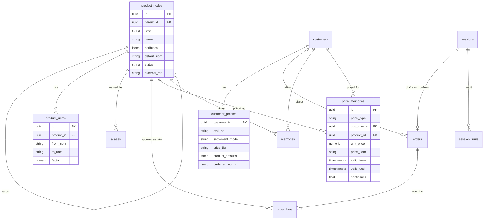
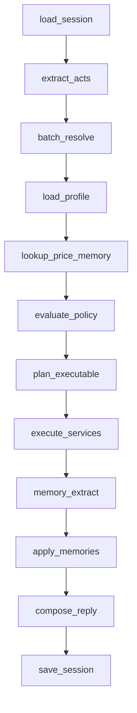

# AI 农批开单员 POC — 设计方案（第一阶段）

> 范围：Agent 后端核心 + V1 最小开单壳。不接 ERP，禁止做成 ERP 前端 App。
> 交互：按真实档口**连续语音开单**设计——30 秒内连报多品、中途改口、同名客户、层级歧义、缺价不打断。
> V1 可不接麦克风/ASR，用文本模拟语音输入；API 与图必须按语音连报契约实现（一条文本可含多动作；`expect_more` 时禁止打断追问）。

仓库根目录即项目根目录（GitHub 仓库已名为 `ai-order-clerk`），不再套一层同名文件夹。

配套文档（本文件仍是最高设计依据）：

| 文件 | 用途 |
| --- | --- |
| [ROADMAP.md](ROADMAP.md) | 产品阶段 |
| [DOMAIN.md](DOMAIN.md) | 农批业务知识 |
| [AI_RULES.md](AI_RULES.md) | Agent 行为规范 |
| [AI_DEVELOPMENT_GUIDE.md](AI_DEVELOPMENT_GUIDE.md) | Cursor Master Prompt：正式开发入口 |
| [ADR/](ADR/) | 架构决策；模板 [ADR_TEMPLATE.md](ADR/ADR_TEMPLATE.md)。Sprint 6A：[ADR-008](ADR/ADR-008-http-turns-not-chat.md) |
| `/.cursorrules` | AI 辅助开发强制规则 |

---

## 0. 农批特殊性（评审结论）

农批开单和零售点餐、电商下单不是同一类问题。上一版把「苹果」直接当成 SKU、把价格整段划出范围，会在真实档口对话里失效。

| 零售/表单假设 | 农批实际 | 设计后果 |
| --- | --- | --- |
| 商品 = 一个 SKU 名 | 「苹果」是品类/品种口语，真正履约要落到品种+等级+产地+规格+包装 | 必须有 Product Ontology；行上允许「解析层级」 |
| 用户每次选全规格 | 熟客只报品名数量，缺槽靠「他一直拿什么」 | Customer Profile 可填默认 SKU，但有闸门 |
| 下单必带价 | 先报量、价按今日行情或老价格，且行情日变 | Price Memory 带有效期；允许 `price_tbd` |
| 重复报数量 = 再买一份 | 光杆再报同一品通常是改口 | 合行策略保持覆盖；「加」才累加 |
| 单位单一 | 开单用「件/个」，计价常按「斤」，件重还会变 | 数量单位与计价单位分离 |
| 记聊天就能个性化 | 60 件、好了、口误都不是知识 | 记忆只经 Extractor；价格记忆尤其要过期 |

第一阶段仍不做：库存扣减、结算收款、送货调度、ERP 实连、麦克风/ASR/TTS、登录、多租户。  
第一阶段**要做**：多动作连报、非打断澄清、同名客户消歧、本体层级、价格 TBD、领域事件总线（给采购/库存/付款/分析留口）、HTTP turns 入口、Session Timeline、文本模拟麦的 Demo Shell。  
V1 **允许**一个开单壳（巨大输入、只读草稿、口播 `reply_text`）；**禁止**把 Demo 做成加行表单 / ERP 页面。

---

## 1. 项目结构

```text
ai-order-clerk/
├── app/
│   ├── main.py
│   ├── api/
│   │   ├── deps.py
│   │   ├── schemas.py
│   │   └── routers/
│   │       ├── health.py
│   │       ├── sessions.py
│   │       └── orders.py
│   ├── agent/                  # LangGraph；禁止 ORM
│   │   ├── graph.py
│   │   ├── state.py
│   │   ├── nodes/
│   │   ├── tools.py
│   │   ├── prompts.py
│   │   └── llm.py
│   ├── policy/                 # 确定性决策表，禁止 LLM 改写结论
│   │   ├── decision.py
│   │   ├── slot_priority.py
│   │   ├── issue.py            # blocking | line_hold | notice
│   │   └── confirm_gate.py
│   ├── session/
│   │   ├── runner.py           # 已落地：parse → policy → service
│   │   ├── intake.py           # Sprint 6A：utterance_id / seq / is_final
│   │   ├── timeline.py         # Sprint 6A：业务事件，禁止聊天记录
│   │   ├── state_machine.py    # 目标：draft → confirming → confirmed / cancelled
│   │   └── working_memory.py
│   ├── memory/
│   │   ├── extractor.py
│   │   ├── policy.py
│   │   └── types.py
│   ├── entity/
│   ├── models/
│   ├── database/
│   ├── services/
│   │   ├── customer_service.py
│   │   ├── customer_profile_service.py
│   │   ├── product_service.py          # 检索
│   │   ├── ontology_service.py         # 层级解析、默认子节点
│   │   ├── order_service.py
│   │   ├── session_service.py
│   │   ├── memory_service.py
│   │   ├── price_memory_service.py
│   │   └── ports/
│   │       ├── erp.py
│   │       ├── inventory.py    # Phase1 NoOp
│   │       ├── payment.py
│   │       └── purchasing.py
│   └── tests/
│       ├── test_intent.py
│       ├── test_ontology_resolve.py
│       ├── test_profile_defaults.py
│       ├── test_price_memory.py
│       ├── test_burst_multi_act.py
│       ├── test_customer_homonym.py
│       ├── test_decision_policy.py
│       ├── test_order_merge.py
│       └── test_api_turns.py   # Sprint 6A 契约测试
├── alembic/
├── docs/DESIGN.md
├── pyproject.toml
├── .env.example
└── README.md
```

### 1.1 分层与依赖方向

```text
api  →  agent  →  tools  →  services  →  models/database
              ↘  policy          （纯函数，只吃结构化快照）
              ↘  session
              ↘  memory/extractor → memory_service / price_memory_service
              ↘  response        （ReplyPlan → 口播；禁止改裁决）
entity  ←  被 agent / policy / services / api / response 共用
```

硬约束：

| 模块 | 允许 | 禁止 |
| --- | --- | --- |
| `agent/` | 读 entity、调 tools、维护 GraphState | import models/database；自己决定能否确认 |
| `policy/` | 对 SpeechAct[] + 解析结果 + Profile + PriceMemory 做裁决 | 调 LLM、写库；把缺价当阻断 |
| `memory/extractor` | 产出 MemoryCandidate | 直接落库 |
| `response/` | 读 `ReplyPlan`，拼出口播 | 读 Catalog/PriceMemory/Session；改 `DecisionVerdict`；写 Memory/草稿 |
| `services/` | ORM、事务、ERP Port | 调 LLM、绕过 policy 的确认闸门 |
| `api/` | 启会话、投递 turns、投影 Timeline 与只读草稿 | 自然语言直接进 SQL；保存聊天记录；绕过 Runner/Policy；表单加行 |

AI 不操作数据库：图节点只发 `ServiceCommand`。能否澄清、能否用档案默认、能否带价、能否「好了」，以 `policy/` 的 `DecisionVerdict` 为准，模型不得否决。

### 1.2 模块职责

- **ontology**：商品层级与别名；把口语提到的层级变成可履约节点。
- **product resolver**：`product_mention` 生文本 → 本体节点。只识别，不写 Memory，不套档案默认。
- **customer profile**：熟客缺槽默认值；由 Policy 决定是否填充。
- **price memory**：带有效期的报价/成交；禁止静默套 `last_deal` 或过期价。
- **policy**：槽位优先级、澄清阈值、确认闸门。只决定 `reply_mode` / Issue，不写台词。
- **session**：本单工作记忆。
- **memory**：Extract → MemoryPolicy → MemoryService。禁止订单确认直接写长期记忆。
- **response**：`snapshot + verdict → ReplyPlan → TemplateResponseGenerator → ReplyGrounder`。只表达，不裁决。`reply_scope=changed_only` 用于连报 ack。提醒只渲染 `ReplyPlan.notices`，禁止 Memory 直接触发回复。
- **business context**：绑客户后的只读投影（本单行相关的档案默认与价格记忆事实）。禁止把 Profile/Memory 全量塞进 Session。未绑定客户不得加载。
- **api / intake**：HTTP 适配层。唯一自然语言入口是 `POST /v1/sessions/{id}/turns`。只包装现有 Runner，不改 Parser / Resolver / Policy / Memory / OrderService / Response。
- **session timeline**：按会话追加业务事件（开单、加行、确认、同名客户阻断等）。独立于 `SalesSession`，**不是** IM 历史，禁止保存用户原话。
- **demo shell**：文本模拟语音输入。展示口播与只读草稿。禁止加行表单、库存、收款、登录。

Sprint 6A 已落地（其余仍为目标结构）：`app/main.py`、`app/api/routers/sessions.py`、`app/session/intake.py`、`app/session/timeline.py`、`app/api/static/index.html`。V1 不提供表单加行的 orders 写接口。

`TurnParser`（`parse(text) -> TurnParse`）是唯一语言入口。`RuleTurnParser` 与 `LLMTurnParser` 可互换。LLM 只抽 SpeechAct；失败必须 fallback 到规则 Parser，并保留 `parser_name` / `fallback` / `fallback_reason`。LLM 输出 Schema 经转换层才变成领域 `SpeechAct`。禁止依赖 LLM 才能开单。

`RuleTurnParser` 只做「文本 → SpeechAct」：动词、数量、单位、改口标记。禁止依赖商品本体、客户、价格或别名表。


---

## 2. 核心数据模型

分三套，禁止混用：

1. **Entity（领域）**：Agent / Service / Policy 之间传递。
2. **ORM Model（持久化）**：表映射，不出 Agent。
3. **API Schema**：HTTP 入出参，可从 Entity 投影。

### 2.1 领域实体（`app/entity`）

```text
# 商品本体
OntologyLevel      category | variety | cultivar | sku
ProductNode        id, level, parent_id?, name, attributes, default_uom, status
ProductAttributes  origin?, grade?, size?, packing?, piece_weight?, season?
ProductMention     raw, matched_node, resolved_sku?, resolve_level, confidence, candidates[]

# 客户档案（display_name 不唯一）
CustomerRef        id?, name, stall_no?, phone_tail?, last_order_at?,
                   aliases[], match_confidence, candidates[]   # 同名时 candidates 必填
CustomerProfile    customer_id, display_name, stall_no?, phones[],
                   settlement_mode, price_tier, product_defaults[], preferred_uoms[]

# 语音回合（一条 ASR 可含多个动作）
SpeechAct          type, slots, span, target_line_id?, confidence
TurnParse          utterance_id, seq, expect_more, is_final, acts[]   # 取代单 Intent
Issue              code, block_level: session_block | line_hold | notice,
                   subject_line_id?, options[], ask_when: now | idle | confirm

# 数量与价格（单位分离）
Quantity           value: Decimal, uom: str                 # 开单单位：件/个/箱
MoneyAmount        value: Decimal, currency: CNY
PriceQuote         unit_price, price_uom, source, valid_until?, confidence
                   # source: explicit | last_deal | last_quote | customer_special | market_today | tbd

# 订单
OrderLine          line_id, mention: ProductMention, product_sku_id?,
                   qty: Quantity, price: PriceQuote?, merge_op, line_status
DraftOrder         order_id?, customer, status, lines[], remarks?, price_mode
ConfirmedOrder     冻结快照；允许行价为 tbd（见确认闸门）

# 决策与记忆
Intent             废弃为单回合主类型；实现用 SpeechAct.type
ServiceCommand     name, payload
MemoryCandidate    type, subject, key, value, confidence, action, valid_until?
DecisionVerdict    allow_execute, commands_ok[],
                   issues[],          # 分级，不再用「有澄清就整图停」
                   confirm_ok, reasons[], reply_mode: ack | recap | ask
SessionSnapshot    session_id, status, draft, profile_digest?,
                   focus_line_id?,    # 「刚才那个」
                   deferred_issues[],
                   pending_session_blocks[],  # 仅同名客户等会话级
                   turn_index
AgentTurnResult    reply_text, snapshot, verdict, commands_executed[], memories_applied[],
                   generator_name, reply_plan?

# 表达层（Sprint 4A）
SourceRef          kind: qty | price | sku | customer | stall | uom,
                   text, origin: draft_line | customer_ref | issue_option | verdict,
                   subject_id?
ReplyLineFact      line_id, label, qty_text, uom, price_text?, price_tbd, from_profile, sku_text?
ReplyQuestion      code, option_labels[]
ReplyPlan          mode, reply_scope: changed_only | full, confirmed,
                   customer_label?, lines[], question?, notices[], source_refs[], must_say[]
ReplyNotice        code, severity, source_refs[]   # 禁止存最终中文
NoticePriority     high | normal | low   # 预留，5A 不排序

# 业务摘要（Sprint 5A，只读投影）
BusinessContext    customer_id?, profile_defaults[]（仅本单已用）, price_facts[]
PriceRiskFact      line_id?, sku_id, price_type, unit_price, price_uom, expired
```

`line_status`：`unresolved | pending_clarify | ready | price_tbd | confirmed`。  
`resolve_level` 未到 `sku` 时，Policy 决定：用档案默认 / 用唯一子节点 / 追问，禁止模型直接点选。

### 2.2 言语行为（SpeechAct），不是单意图

一回合必须解析为 **acts 数组**，按 span 顺序执行。禁止 `classify_intent → 单一 Intent`。

| SpeechAct | 例句 | 槽位 |
| --- | --- | --- |
| `start_order` | 「开王老板的单」 | customer_mention |
| `add_line` | 「加两个金边榴莲」 | product_mention, qty, uom? |
| `set_line` | 「苹果60件」 | product_mention, qty, uom? |
| `remove_line` | 「梨不要了」 | product_mention 或 anaphora |
| `replace_product` | 「梨换成桃子」 | from, to |
| `refine_spec` | 「要烟台的」「红富士」 | attributes / child_mention；默认打在 focus 行 |
| `set_qty` | 「不对改80」「再加10件」 | qty, uom?, anaphora? |
| `set_price` | 「苹果按3块」 | product_mention?, unit_price, price_uom? |
| `use_old_price` | 「还是老价格」 | product_mention? |
| `confirm_order` | 「好了」 | — |
| `cancel_order` | 「这单作废」 | — |
| `query_draft` | 「现在有啥」 | — |
| `clarify` | 「3号档那个」 | 回答 session_block 或 line_hold |
| `unknown` | 听不清 | — |

行合并策略（农批口述，写进 `OrderService`）：

- 无该品行 + 光杆「品名+数量」→ **新增**。
- 已有该品行 + 光杆「品名+数量」→ **覆盖数量**（改口）。
- 「加 / 再来 / 再加」→ **累加**。
- 「改成 / 改到」→ **覆盖**。
- 「品名」对齐键 = `line_id`。解析升级（苹果 variety → 红富士 sku）**不得新开一行**。
- 指代：未提品名的「不对 / 改成 / 再加 / 不要了」打在 `focus_line_id`（最近成功落地或刚提及的行）。
- 同一 TurnParse 内按顺序应用：先「苹果60」再「不对80」→ 最终 80。

### 2.3 会话工作记忆 vs 长期记忆

| | 工作记忆（session） | 长期记忆 |
| --- | --- | --- |
| 生命周期 | 随开单会话 | 跨会话，价格类必须有过期 |
| 内容 | 客户、草稿行、待澄清、本单显式价、最近 K 轮结构化摘要 | 别名、档案默认、成交价/特价 |
| 写入 | SessionService | Extractor → MemoryService / PriceMemoryService |
| 不存 | 聊天全文 | 当笔数量、口误、已过期行情、整句原文 |

最近 K 轮只存 `{acts, entity_ids, command_names, verdict_reasons}`。`customers.display_name` **不唯一**。`aliases` 唯一约束为 `(target_type, target_id, lower(alias))`，**禁止** `(target_type, alias)` 全局唯一——否则两个王老板无法共存。

---

## 3. 数据库设计

PostgreSQL。UUID 主键，`created_at`/`updated_at`。

### 3.1 ER 关系



其余表（`customers`、`aliases`、`sessions`、`orders`、`order_lines`、`memories`、`session_turns`、`outbox_events`）职责同前，变更如下。

### 3.2 相对上一版的表变更

**product_nodes 替换扁平 products**  
`level ∈ {category, variety, cultivar, sku}`。只有 `sku` 可写入 `order_lines.product_id`（履约行）。口语匹配可以打在任意层。`attributes` 放产地/等级/规格/包装/件重/产季，不另拆宽表（POC）。

**product_uoms**  
例如某 SKU「1 件 = 20 斤」。开单单位与计价单位不一致时，PriceMemoryService 只换算有因子的行；没有因子则 Policy 澄清，禁止估算件重。

**customer_profiles**  
1:1 客户。`product_defaults`: `{ "variety_or_node_id": "sku_id" }`。`preferred_uoms` 同理。结算方式、价格档只归档，第一阶段不跑账期。

**order_lines 增列**

- `matched_node_id`：口语落到的本体节点
- `product_id`：可空，直到履约 SKU 确定
- `qty`, `uom`
- `unit_price`, `price_uom`, `price_source`, `price_status`（`explicit|memory|tbd|none`）

**price_memories**（独立于通用 memories）  
价格有时效、金额、计价单位，不和别名混在一张 jsonb 里。`price_type ∈ {market_today, last_deal, last_quote, customer_special}`。

**memories.mem_type 增补**

- `customer_alias` / `product_alias`（可同步 aliases）
- `preferred_uom`
- `product_default`（档案：王老板的苹果 → 某 sku）
- `customer_habit`：默认 ignore

**outbox_events** 仍在 confirm 时写 `order.confirmed`。payload 含行级 `price_status`，便于 ERP 侧决定是否暂缓生成 Sales Order 金额。

### 3.3 索引（POC）

- `product_nodes (parent_id, level)`
- `aliases (target_type, target_id, lower(alias))` 唯一；按 alias 查询返回列表
- `price_memories (price_type, product_id, customer_id, valid_until)`
- `order_lines (order_id, line_no)` 唯一
- `memories (mem_type, key)`

种子主数据必须是**树**，不是平铺同名 SKU：水果 → 苹果/梨/榴莲 → 红富士/金边榴莲等 → 带等级产地的 sku。模糊匹配可用 `pg_trgm`。

---

## 4. API 设计

会话是业务任务（`SalesSession`），不是聊天室。`POST /v1/sessions` 只创建任务上下文，不创建 IM 频道。

| 方法 | 路径 | 作用 |
| --- | --- | --- |
| `POST` | `/v1/sessions` | 开一个销售开单任务 |
| `GET` | `/v1/sessions/{id}` | 只读草稿投影 + Session Timeline（无用户原话） |
| `POST` | `/v1/sessions/{id}/turns` | **唯一自然语言入口** |

HTTP 适配层处理 `utterance_id` / `seq` / `is_final` 后，把 `text` 交给现有 `SalesSessionRunner.handle`。禁止 API 直连 Repository、禁止绕过 Policy、禁止把用户原话写入 Timeline。

唯一自然语言入口：`POST /v1/sessions/{id}/turns`。为语音连报增加控制字段（V1 用文本模拟麦）：

```json
{
  "text": "苹果60件梨60件加两个金边榴莲不对榴莲改三个",
  "source": "voice",
  "utterance_id": "utt-...",
  "seq": 4,
  "is_final": true,
  "expect_more": true
}
```

| 字段 | 含义 |
| --- | --- |
| `utterance_id` | 幂等；ASR partial+final 重复投递则跳过 |
| `seq` | 保序；乱序到达则缓冲或 409 |
| `is_final` | POC **只处理 true**；partial 丢弃，避免半句落库 |
| `expect_more` | true=连报未结束：可执行加行/改口，**不发追问**，`reply_mode=ack`；false 或 `confirm_order`：`recap`，idle 级问题可问 |

Sprint 6A 适配层语义（不进 Runner）：

- `is_final=false`：丢弃，不调用 Runner，草稿与 Timeline 不变。
- 同一 `utterance_id` 重复投递：返回首次成功响应（幂等）。
- `seq` 乱序或出现空洞：`409`。V1 不缓冲乱序包。

响应含 `reply_text`、`verdict.issues`（分级）、当前草稿只读投影、Timeline。`price_tbd` 只出现在 `notice`，不得进入 `pending_session_blocks`。`reply_text` 不写入 Timeline。

同名客户：`CustomerRef.candidates` 列出 `name, stall_no, phone_tail, last_order_at`，`block_level=session_block`。未消歧前：货行进 `session.buffer`，**不**套任何档案默认。

`GET /v1/orders/{id}` 返回每行本体路径、数量、价格来源、`price_status`。不提供表单加行。已确认再加行 409。Sprint 6A 不实现独立 orders 写接口；草稿随 session 只读返回。

### 4.1 Session Timeline

Timeline 是业务事件流，按 `session_id` 独立存储，**不**写入 `SalesSession`，**不**保存聊天记录。

允许的事件类型（由领域事件与 `session_block` Issue 投影）：

- `order.started`
- `order.line_upserted` / `order.line_removed`
- `order.confirmed`
- `customer_ambiguous`（同名客户阻断）

payload 只含结构化业务字段（客户 id、行 id、数量、单位、issue code、候选档口名等）。

禁止出现的键（大小写不敏感）：`user_text`、`raw_text`、`text`、`utterance`、`chat`、`message`。口播 `reply_text` 只出现在当轮 turns 响应里，供 Demo 念/显示，不进入 Timeline。

---

## 5. Agent 流程设计

LLM **一次调用**把整段 `text` 抽成 `TurnParse.acts[]`（带 span）。禁止对每个商品单独跑一轮图。解析、默认值、闸门仍是 Service + Policy。

### 5.1 图状态

```text
GraphState
  session_id, turn: TurnParse
  snapshot
  acts                # SpeechAct[]
  mentions            # 批量 ProductMention / CustomerRef
  profile
  prices
  verdict             # 含 issues[] 与 reply_mode
  commands, execution
  memory_candidates
  reply_text
```

### 5.2 节点与边



**废除**「clarifications 非空 → 跳过 execute」。可执行的 act 一律落地；不能执行的变成分级 Issue。

| 节点 | 做什么 | 不可做什么 |
| --- | --- | --- |
| `extract_acts` | 一段话 → 有序 SpeechAct[] | 只取第一句意图 |
| `batch_resolve` | 本回合所有品名/客户一次检索 | N 次串行 LLM |
| `evaluate_policy` | 每 act 裁决；`expect_more` 时 ask_when=idle 的问题入 deferred | 因缺价/规格打断后续加行 |
| `execute_services` | 同一事务按序 apply | 半句失败回滚已成功的**前面**行（应部分成功：已清行保留，失败 act 记 issue） |
| `compose_reply` | 已聚合的 verdict + 本回合变更行 → ReplyPlan → 模板口播 → 白名单 Grounder | 连报念全单；问价问规格；读档案补 SKU 名；否决 confirm_ok |

部分成功：苹果、梨已写入，榴莲歧义 → 两行 ready/tbd，榴莲 line_hold，回复 ack 不提问（若 expect_more）。

### 5.3 工具

1. `lookup_customer(mention) -> CustomerRef`（必含 candidates）
2. `lookup_product_nodes_batch(mentions[]) -> ProductMention[]`
3. `get_customer_profile(customer_id)`
4. `lookup_prices(customer_id?, sku_ids[])`
5. `start_draft(customer_id)` — 客户未唯一时拒绝，货进行缓冲
6. `apply_line` / `apply_line_price` / `replace_line_product` / `refine_line`
7. `confirm_draft` — Service 再跑 confirm_gate
8. `cancel_draft` / `get_draft`

工具入参禁止 `raw_text`。批次查找是连报 30 秒的性能底线。

### 5.4 目标对话（修订）

| 用户 | 关键裁决 |
| --- | --- |
| 开王老板的单 | 绑客户，加载 Profile |
| 苹果60件 | 本体落到「苹果」variety；若档案有默认 sku 则填入并在回复中点明；价无记忆则 `price_tbd` |
| 梨60件 | 同上 |
| 加两个金边榴莲 | cultivar 唯一子 sku 则可自动落到叶；单位「个」 |
| 好了 | confirm_gate：客户+行履约层级够；价可 TBD；回复必须列出 TBD 行 |

若老板随后说「苹果按3块」，Intent=`set_price`，价 `explicit`，Extractor 才可建议 `last_quote` / 达阈值后的 `customer_special`。

### 5.5 扩展点：事件与端口（采购/库存/付款/分析）

销售 Agent **不调用**库存扣减、收款、采购单。确认与行变更只发领域事件，其它限界上下文订阅。

```text
OrderService 变更
  → outbox:
      order.started
      order.line_upserted
      order.line_removed
      order.confirmed          # 可含 prices_incomplete
      order.cancelled
      order.price_filled       # 确认后补价
  → Sales 端口：ErpPort.submit（Phase1 NoOp）
  → InventoryPort.on_confirmed   Phase1 NoOp（以后预留/出库）
  → PaymentPort 不在 confirm 时强制
  → PurchasingPort 不在本图
```

共享内核（多上下文只读）：Product Ontology、Customer、Price Memory。  
经营分析：**只读已确认订单 + 行**（TBD 价不计入 GMV 或单独口径），禁止扫 session_turns。  
采购：未来独立会话类型 `purchase_session`，复用本体与 SpeechAct，不塞进销售图。  
付款：`payments` 聚合，一单可 confirmed 且 unpaid。

---

## 6. Product Ontology

### 6.1 层级

```text
category     水果 / 蔬菜 / …
  variety    苹果 / 梨 / 榴莲
    cultivar 红富士 / 金边 / 金枕
      sku    红富士 80# 一级 烟台 件装    ← 唯一可履约、可挂价、可进 ERP
```

口语可能打在任意层。「金边榴莲」通常是 cultivar；「苹果」是 variety；「两个金边榴莲」仍可能要问规格，除非该 cultivar 下只有一个 active sku 或档案有默认。

### 6.2 解析流水

1. 规范化别名（金边、金边榴莲、榴莲金边）。
2. 在 `product_nodes` + `aliases` 匹配，保留 top-N。
3. 若命中非 sku：看 Profile.product_defaults[node]；再看是否**唯一** active 子 sku（含产季 status）。
4. 多候选且置信差 &lt; 阈值 → **line_hold**，不填 sku，**不停止**本回合后续 act。
5. 行按 `matched_node` 落草稿。后续 `refine_spec` 升级同一 `line_id`。

过季：`status=seasonal_off` 的节点降权，不得作为静默默认。禁止自动替品（没金边改金枕）—— 农批替品等于改货，必须问。

### 6.3 单位

- `default_uom`：该节点开单习惯（榴莲「个」，苹果「件」）。
- `product_uoms.factor`：只用于计价换算，不在对话里把 60 件改写成斤，除非用户用斤报。
- 用户说的单位与 default 冲突：以**本句 explicit** 为准，Extractor 才考虑更新 `preferred_uom`。

---

## 7. Customer Profile

### 7.1 档案里有什么

| 字段 | 用途 | 不是 |
| --- | --- | --- |
| display_name / aliases | 「王老板」能**查到列表** | 唯一键；禁止全局 alias 唯一 |
| stall_no / phones | 复述、以后 ERP Customer | 第一阶段验证码/登录 |
| settlement_mode | cash/credit/unknown，仅标注 | 账期引擎、信用额度 |
| price_tier | wholesale/familiar/unknown | 自动改价公式 |
| product_defaults | 某本体节点 → 默认 sku | 全市场默认货 |
| preferred_uoms | 某节点 → 件/个 | 改变计价单位 |

档案是**缺槽填充器**，不是另一份订单。没有绑定客户时，禁止使用任何 profile 默认。

### 7.2 谁可以写入

- 种子/主数据：档口、电话、价格档。
- Extractor 允许：多次确认单后同一「苹果→某 sku」→ `product_default` 候选（建议阈值 ≥ 3 张已确认单，POC 可先只种子、不自动写）。
- Extractor 禁止：把本单 60 件写成「他每次 60」；一次澄清「今天拿青苹果」写成永久默认（除非用户明确「以后都拿这个」—— 第一阶段无此意图则一律不写）。

### 7.3 使用规则

回填必须在回复里**可见**：例如「苹果按您常拿的红富士 80#」。用户下句否定（「不要红富士」）→ 清该行默认、改 pending，本单不再用该 default。

---

## 8. Price Memory

第一阶段做「价的记忆与回填」，不做收款、优惠券、改总账。Agent **禁止生成任何未在 PriceQuote 中出现的数字**。

### 8.1 四种价

| type | 范围 | 有效期 | 何时产生 |
| --- | --- | --- | --- |
| `market_today` | 常无客户，挂 sku | 当日营业结束 | 主数据/外部行情（POC 可种子）；用户说「今天苹果3块」经 Extractor |
| `last_deal` | 客户+sku | 建议 7 日，可配置 | **仅**订单确认且该行 `price_source=explicit` 或已入账价 |
| `last_quote` | 客户+sku 或本会话 | 建议 24h | 本句 `set_price` |
| `customer_special` | 客户+sku | 明确截止或 30 日 | 重复 quote 达阈值，且闸门允许 |

`price_uom` 必须存。3 元/斤 与 3 元/件 不得混用。无换算因子时不得把件价当斤价用。

### 8.2 回填优先级（价）

对本行，在 Policy 中写死：

1. 本句 explicit（`set_price` / 句中带价）
2. 本会话已对该 sku 报过的价
3. 未过期 `customer_special`
4. 未过期 `last_quote`
5. 未过期 `last_deal`（仅当 Intent 为 `use_old_price`，或 price_mode 允许静默用老价—— **POC 默认不允许静默用成交价**，避免行情已变仍按上周价）
6. 未过期 `market_today`（POC 默认不静默，只在回复中可提示「今日行情 x，要按这个吗？」—— 提示也必须来自记忆，不能编）
7. `tbd`

冲突：若 special 与 market 偏差超过阈值（建议 10%），必须澄清，不得平均、不得取中间。

Sprint 5A：`last_deal` / `market_today` **只提供事实**。Policy 可生成 `notice`（未采用 / 已过期 / 行情未写入），**不得改订单行价**。禁止 Memory 或 ContextLoader 直接触发口播。

### 8.3 Extractor 与价格

**可记：** 本句明确单价且已解析到 sku；确认单上 `price_source=explicit` 的行 → `last_deal`。  
**不可记：** TBD 行；未到 sku 的价；「便宜点」无数字；过期后的行情。  
确认闸门未过的草稿价，只留在 working_state，不进 `price_memories`。

---

## 9. Decision Policy

独立模块 `app/policy`，输入全是结构，输出 `DecisionVerdict`。测试必须覆盖本表，不靠 prompt。

### 9.1 槽位填充总序

对任意缺槽（客户、sku、单位、价格）：

1. 本回合 explicit  
2. 本会话 working_state  
3. 已绑定客户的 Profile  
4. 本体唯一 active 子 sku（非过季）  
5. Price Memory（仅价格槽，且遵守 §8.2）  
6. Ask → 写入 `Issue`（见 §9.0），**不要**再使用无分级的 `pending_clarifications` 打断整图

禁止跨客户、禁止用「全市场最热销 sku」冒充默认。

### 9.0 Issue 分级（连报能否不断是本条）

| block_level | 典型 | expect_more=true | expect_more=false / 好了 |
| --- | --- | --- | --- |
| `session_block` | 同名客户未消歧 | 货进行缓冲；立刻问客户（否则档案会用错） | 不能 confirm |
| `line_hold` | 该行 SKU 歧义、无默认 | **该行挂节点，后续品继续收**；问题进 deferred | idle 时一次问一行或汇总；confirm 时成为闸门 |
| `notice` | `price_tbd`、档案已用、未采用 last_deal、过期价、行情未写入 | **ack 不说**；问题进 deferred | recap/确认时由 ReplyPlan.notices 表达；**不阻止 confirm**；**不改行价** |

价格记忆冲突：连报中当 `line_hold` 仅挂在价槽，**数量行仍落地**；不问价直到 idle。禁止把缺价写成 session_block。

### 9.2 澄清 vs 默认

| 条件 | 动作 |
| --- | --- |
| 唯一别名命中，confidence ≥ 0.9 | 采用 |
| 命中 variety/cultivar，档案有 default sku | 采用并标记 `filled_from=profile` |
| 命中非叶节点，唯一 active 子 sku | 采用并标记 `filled_from=ontology_unique_child` |
| 两个候选置信差 &lt; 0.15 | 澄清，列出短名 |
| 替品、过季货、无因子的单位换算 | 必须问 |
| 「苹果」无档案、多个 sku | **line_hold**：行挂 variety，继续收后续品；idle/好了再问 |
| 价格记忆冲突 &gt; 10% | 数量仍落地；价槽 line_hold/notice；连报不问 |
| 未绑客户就报货 | 有 session_block（同名或未选客户）则行进 buffer，**不**套档案 |

### 9.3 确认闸门（「好了」）

`confirm_ok` 当且仅当：

1. 客户已绑定  
2. 至少一行  
3. 每行已到履约 sku（经 explicit / profile / unique child，且用户未否定）  
4. 每行数量、开单单位合法  
5. 无 `session_block`；无未解决的 `line_hold`（`notice` 不算）  
6. 价格：见 `price_mode`（缺价 = notice，默认不挡确认）

POC 默认 `price_mode = qty_first_price_optional`：

- 允许确认时存在 `price_tbd` 行  
- 回复必须逐行说清：有价的说来源（您报的 / 刚才报的），无价的说「价未定」  
- 不得把 TBD 说成已按某数成交  

可选档 `strict_price`（以后接 ERP 金额时切换）：任何 TBD 则 `confirm_ok=false`，追问价或「按今日行情」。即使该档，行情数字也只能来自未过期 `market_today`。

Service 层 `confirm_draft` 必须再执行同一闸门。图节点 verdict 过期或被绕过时，以 Service 为准。

### 9.4 回复义务

Policy 决定 `reply_mode`。表达层不得改 mode。

- `reply_mode=ack`（连报中）：`reply_scope=changed_only`，只报**本回合**落地行，不问规格、不问价、不念全单。  
- `reply_mode=recap`：`reply_scope=full`。用了档案默认必须说 SKU 全称；TBD 必须说「价未定」；改口说新数量。  
- `reply_mode=ask`：仅 session_block，或 idle/好了时的 line_hold。一次回复最多一个会话级问题。  
- `session_block`（同名客户）优先于 `expect_more` 的 ack：必须立刻问哪一家。未消歧不得套档案，回复不得泄露 Profile 默认 SKU、未授权价格。  
- 拒绝编造库存、到货日、折扣、价格数字。

### 9.5 Response Layer 与 Grounding

```text
verdict + session snapshot + changed_line_ids
  → ReplyPlan（含 source_refs）
  → TemplateResponseGenerator.generate(plan)
  → ReplyGrounder.check(text, plan)
  → reply_text
```

- Generator **只读 ReplyPlan**，禁止访问 Catalog、Profile、PriceMemory、Session。  
- `source_refs` 列出允许出现在回复中的数字、价格、SKU 名、客户名、档口号、单位。  
- Sprint 4A Grounder 为**白名单**：从回复中按最长优先删去 `source_refs.text` 与固定虚词；若仍有剩余字符则非法。不做 NLP。  
- `TemplateResponseGenerator` 只拼接 Plan 字段与固定虚词（记下了、当前草稿、价未定、按档案、单已确认、请问是哪一家、还没有货）。  
- 接地失败：回退到同样只含 Plan 字段的安全拼接，记下 `reply_fallback_reason=grounding_violation`。  
- `reply_scope=changed_only`：`notices` 必须为空。  
- `reply_scope=full`：Planner 把 verdict 里 `block_level=notice` 的 Issue 变成 `ReplyNotice`（code / severity / source_refs），**不拷贝 Issue.message**。模板按 code 拼虚词 + refs。  
- `NoticePriority` 字段预留，5A 不按优先级排序。  
- 流程：`BusinessContext → Policy.collect_notices → Issue(notice) → ReplyPlan.notices → Response`。禁止 ReminderAgent，禁止 Memory 直连 Generator。

---

## 10. Memory Extractor（与档案/价格对齐后）

输入：Intent、本体解析、Profile 差量、价差量、确认结果。输出默认空。LLM 只建议，规则闸门否决则不写。

| 候选类型 | 可写条件 | 禁止 |
| --- | --- | --- |
| customer_alias / product_alias | 高置信绑定且 aliases 无 | 未解析提及 |
| product_default | 达确认单阈值（POC 可关，仅种子） | 单次「今天换青苹果」 |
| preferred_uom | 同客户同节点连续 N 次 | 一次单位口误 |
| last_quote | set_price 且已到 sku | 无数字 |
| last_deal | 确认且价 explicit | price_tbd 行 |
| market_today | 用户明确「今天××价」或主数据导入 | 模型估计行情 |
| 当笔数量、好了、开单 | — | 一律 ignore |

---

## 11. 第一阶段明确不做

- 麦克风、ASR 引擎、TTS、微信（但 **turns 契约按语音连报实现**；V1 用文本模拟麦）
- ERP 前端、表单加行、复杂 App（允许最小 Demo Shell：输入 + 口播 + 只读草稿）
- 库存扣减、采购执行、车次、打印、收款账期（只留 Port + 事件）
- 自动替品、自动议价、编造行情
- ERPNext 实连
- 用 session_turns / Timeline 全文做 RAG / 经营分析
- 登录、多租户、复杂权限
- Agent 内 SQL
- 单意图分类器、澄清即停图、alias 全局唯一
- 改 Parser / Resolver / Policy / Memory / OrderService / Response 来迁就 Demo

## 12. 建议落地顺序

1. entity（TurnParse / SpeechAct / Issue / Ontology / Profile / PriceQuote）+ ORM + 树状种子（含两个「王老板」）  
2. 无 LLM：一段话规则切分或多 act 夹具 → OrderService 顺序合行/改口  
3. Policy 单测：连报部分成功、expect_more 不问价、同名客户、层级 hold、缺价可确认  
4. Profile / PriceMemory  
5. TurnParser 可替换 + LLM Parser fallback  
6. Response Layer：ReplyPlan + 模板 Generator + 白名单 Grounder + 对话集  
7. BusinessContext 只读投影 + Policy notice（不套价）  
8. Sprint 6A：HTTP `POST /v1/sessions` + `POST /v1/sessions/{id}/turns`；Session Timeline（业务事件，禁止聊天记录）；Web Demo Shell（文本模拟麦）；API 契约测试。内核模块保持不动。  
9. LangGraph：`extract_acts` 一次 LLM + batch_resolve  
10. Extractor 闸门  
11. outbox 事件 + 各 Port NoOp  
12. Sprint 6B（未批准）：真 ASR / TTS，仍走同一 turns 契约  

---

## 13. 实现前架构评审（针对连续语音开单）

评审对象：本文修订前的「一句一意图 + 有澄清就停图」。结论：**不能直接实现**，必须采用上文已写入的修订。下面六条是验收标准。

### 13.1 30 秒内连续报多个商品 — 原设计不通过

| 原问题 | 修订 |
| --- | --- |
| 单 Intent，后半句丢失 | `TurnParse.acts[]`，一次抽取 |
| 图在澄清处短路，第二件永远进不来 | 可执行 act 先落地；歧义只 `line_hold` |
| 每品一次 LLM + 一次查找 | `extract_acts` ×1 + `lookup_product_nodes_batch` |
| 每句长回复打断说话 | `expect_more` → `ack` |
| ASR 半句/重传双记 | 只处理 `is_final`；`utterance_id` 幂等 |

验收：一条 text「苹果60件梨60件香蕉30件」三行都在；其中一件歧义时另外两件仍在。

### 13.2 中途修改商品 — 原设计部分通过

合行覆盖/累加保留。必须补：`replace_product`、`refine_spec`、`set_qty`、`focus_line_id` 指代、「不对」作用在上一行、同一回合内顺序覆盖、解析升级不裂行。

验收：「苹果60件不对80件梨不要了」→ 苹果80、无梨。

### 13.3 多个同名客户 — 原设计不通过

`aliases (type, alias)` 全局唯一会物理上禁止两个王老板。改为按目标实体唯一；查找恒返回列表。消歧用档口/手机尾号/上次开单。未消歧 = `session_block`（防套错档案），货行进 buffer。禁止用「最近一个王老板」静默选。

验收：种子两个王老板；「开王老板的单」必须问哪一个，不得开单成功。

### 13.4 商品层级歧义 — 原设计部分通过

本体树保留。连报时歧义不得停图。`refine_spec` 打在 focus 行。「苹果」+ 下句「红富士」合并同一 `line_id`。过季/替品仍必须问，但问的时机是 idle/好了。

验收：苹果无默认且多 SKU 时行先挂 variety；紧接着「梨60件」梨行仍写入。

### 13.5 价格缺失不中断 — 原设计意图对、机制错

`qty_first` 允许 TBD，但 `pending_clarifications` 与「有澄清就停」会把缺价、价冲突做成打断。现规定：缺价 = `notice`，永不 `session_block`；连报不问价；「好了」默认可确认并声明 TBD。

验收：全程不报价仍可确认；回复含「价未定」；TBD 不进 `last_deal`。

### 13.6 采购 / 库存 / 付款 / 经营分析 — 原设计过薄

只留 ErpPort + 一张 confirmed 事件不够。改为销售上下文发完整 outbox；Inventory/Payment/Purchasing 为 NoOp 端口；分析只读确认单。销售图不掺扣库存、收款、采购。共享内核：本体、客户、价格记忆。

验收：confirm 写出 `order.confirmed`（可 `prices_incomplete`）；代码路径上无库存/付款副作用。

---

实现以前以本文（含 §13 修订与 §14 V1 边界）为准。改 Issue 分级、expect_more 语义、同名客户约束或确认闸门时，先改设计再改代码。

---

## 14. V1 产品边界（Sprint 6A）

V1 目标：老板用嘴（或文本模拟麦）开完一单，并听见「价未定」。

语音是 turns 外壳，不是新 Agent。路径固定：

```text
Demo 输入 / 以后 ASR
  → POST /v1/sessions/{id}/turns
  → TurnIntake（幂等、保序、丢弃 partial）
  → 现有 SalesSessionRunner
  → reply_text（以后 TTS 念）
```

### 14.1 设计影响（6A）

| 层 | 影响 | 不影响 |
| --- | --- | --- |
| Parser / Resolver / Policy / Memory / OrderService / Response | 不改 | 内核裁决与落单 |
| `SalesSession` | 仍是业务任务，不存聊天 | IM 历史 |
| HTTP API | 新增 sessions / turns；适配层处理 `utterance_id`/`seq`/`is_final` | 不直连库、不绕过 Runner |
| Timeline | **新增**业务事件投影 | 不保存 `user_text` |
| Demo | **新增**单页壳：巨大输入、发送、只读草稿、口播 | 不加行表单、库存、支付、登录 |
| 装配 | `AppWorld` 暴露同一份 sessions / events / timeline | 旧 `build_world()` 测试入口保持 |

### 14.2 V1 冻结

- ERP / 库存 / 收款
- 表单加行
- 静默套价
- ReminderAgent
- 登录 / 多租户
- 用 LangGraph 重写开单内核
- ASR / TTS（6B）

### 14.3 Demo 验收

「开李老板的单 → 苹果60件 → 好了」：确认成功，回复含「价未定」；Timeline 有 `order.started` / `order.line_upserted` / `order.confirmed`，全程无用户原话字段。
